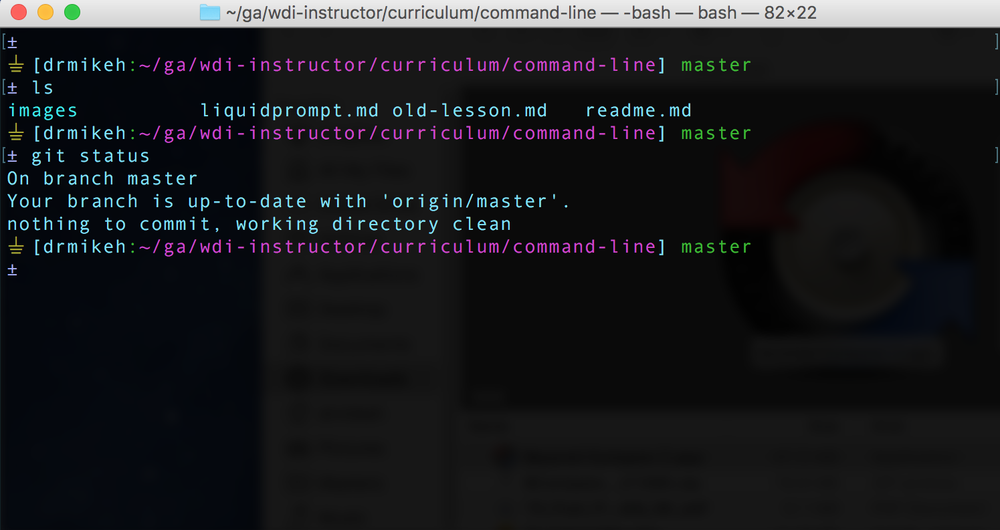

# Liquid Prompt

We can customize the appearance of our BASH prompt to include fun and/or useful information. We can do this manually but there is a very nice GitHub project called _LiquidPrompt_ that contains all of the BASH code to provide us with a very powerful BASH prompt. Also, Liquid Prompt is fully customizable but it does a great job right out of the box!

Here is a screenshot of _LiquidPrompt_ in action:



## Install LiquidPrompt

To install LiquidPrompt, type the following commands into your Terminal:

```bash
cd ~
git clone https://github.com/nojhan/liquidprompt.git
source liquidprompt/liquidprompt
```

## Configure your BASH Shell to Always Use LiquidPrompt

If you like LiquidPrompt and you always want your Terminal sessions to use it, then add the following lines to your `.bashrc` file:

```bash
# Only load Liquid Prompt in interactive shells, not from a script or from scp
[[ $- = *i* ]] && source ~/liquidprompt/liquidprompt
```

## References
[LiquidPrompt](https://github.com/nojhan/liquidprompt)
